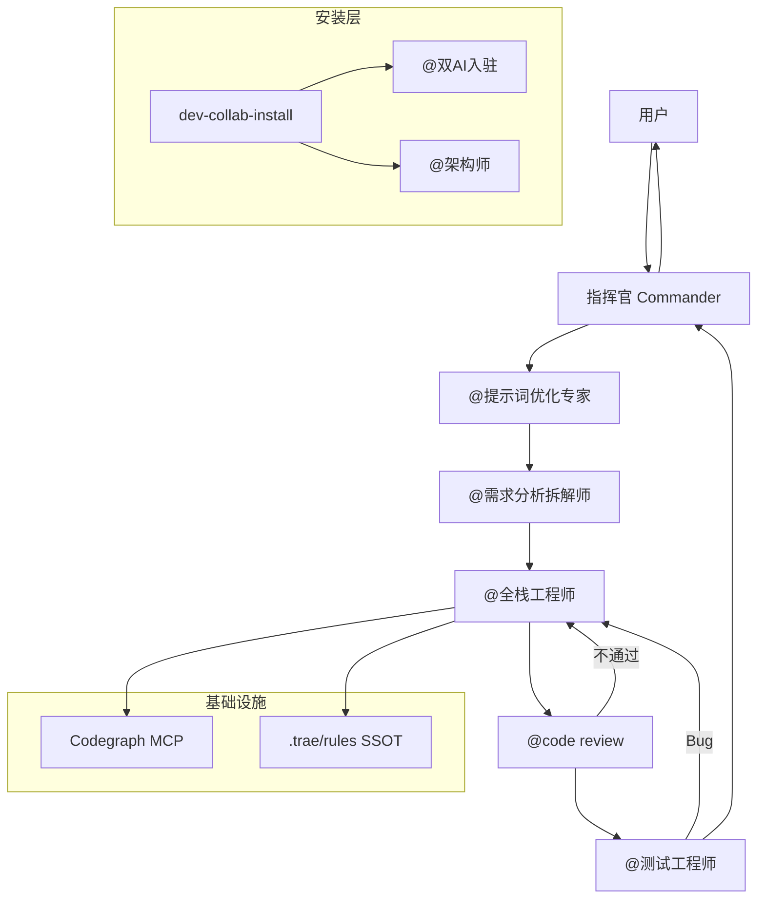

# Dev Collab Toolkit — 开发任务协作工具组

> **版本**: 1.0.0 | **更新**: 2026-06-25
> **适用平台**: Cursor + Trae + Trae-CN（双端通用）

多角色 AI 协作开发工具组：指挥官编排 **提示词优化 → 需求拆解 → 全栈开发 → Code Review → 测试** 完整闭环，并与 **dual-ai-onboarding**、**Codegraph** 深度集成。

---

## 目录

- [概述](#概述)
- [架构](#架构)
- [安装](#安装)
- [Codegraph 安装与使用](#codegraph-安装与使用)
- [使用方式](#使用方式)
- [角色说明](#角色说明)
- [工作流详解](#工作流详解)
- [已有项目 vs 新项目](#已有项目-vs-新项目)
- [MCP 集成](#mcp-集成)
- [目录结构](#目录结构)
- [常见问题](#常见问题)

---

## 概述

### 解决什么问题

| 痛点 | 本工具组方案 |
|------|-------------|
| 需求模糊直接开写 | @提示词优化专家 结构化 + 用户确认 |
| 缺少计划与跟踪 | @需求分析拆解师 生成计划 + 进展文件 |
| 开发无规范 | 项目 `.trae/rules/` + Codegraph 地图 |
| 代码质量无把关 | @code review 循环修正（≤3 次） |
| 联调/测试遗漏 | @测试工程师 + 浏览器 MCP |
| 换项目/换 IDE 配置分裂 | dual-ai-onboarding SSOT + 全局工具组 |

### 触发词

| 场景 | 说法 |
|------|------|
| 发起开发任务 | `开发协作`、`@指挥官`、`开始任务` |
| 安装到项目 | `安装协作工具`、`dev-collab 安装` |
| 单角色 | `@双AI入驻`、`@dual-ai-onboarding`、`@提示词优化专家`、`@需求分析拆解师`、`@全栈工程师`、`@code review`、`@测试工程师`、`@架构师` |

---

## 架构



| 层级 | 路径 | 说明 |
|------|------|------|
| 全局技能 | `~/.cursor/skills/dev-collab-toolkit/` | Cursor 主包 |
| 全局技能 | `~/.trae/skills/dev-collab-toolkit.md` | Trae 入口 |
| 全局技能 | `~/.trae-cn/skills/dev-collab-toolkit/` | Trae-CN 镜像 |
| Cursor 子代理 | `~/.cursor/agents/*.md` | `@指挥官` 等快捷调度 |
| 项目 SSOT | `.trae/rules/`、`.trae/skills/` |
| 项目迭代 | **`iterations/`**（项目根目录，不在 `.trae/` 内） |
| 代码地图 | `.codegraph/codegraph.db` | Codegraph SQLite |

---

## 安装

### 1. 全局工具组（一次性）

工具组已安装于：

```
~/.cursor/skills/dev-collab-toolkit/
~/.cursor/agents/          # commander, prompt-optimizer, ...
~/.trae/skills/dev-collab-toolkit.md
~/.trae-cn/skills/dev-collab-toolkit/
```

换机时复制上述目录即可。

### 2. 安装到具体项目

在项目根目录对 AI 说：

```
安装协作工具
```

或 Read `~/.cursor/skills/dev-collab-toolkit/install/SKILL.md`。

**安装流程**：

1. **Codegraph 检查**（必须）
2. **已有项目** → `@双AI入驻` → 生成/合并 `.trae/rules/`、桥接 `.cursor/rules/`
3. **新项目** → `@架构师` 提供 2–3 方案 → 用户选择 → `@双AI入驻`

### 3. 工具组角色（含可单独 @ 的双 AI 入驻）

| 角色 | 路径 |
|------|------|
| @双AI入驻 | `dev-collab-toolkit/roles/dual-ai-onboarding/` + `~/.cursor/skills/dual-ai-onboarding/`（canonical） |
| agent-browser（Trae 测试可选） | `~/.trae-cn/skills/agent-browser/` |

---

## Codegraph 安装与使用

### 什么是 Codegraph

Codegraph 是项目的 **SQLite 代码知识图谱**（`.codegraph/codegraph.db`），通过 MCP 提供符号搜索、调用链、影响分析。**禁止** 手写 `index.json` 等 JSON 地图。

### 安装 Codegraph CLI

```bash
# 方式一：npm 全局安装（推荐）
npm install -g @codegraph/cli

# 方式二：npx 临时使用
npx @codegraph/cli init -i
```

### 初始化项目索引

```bash
cd /path/to/your/project
codegraph init -i
```

成功后生成 `.codegraph/codegraph.db`。

### 配置 MCP（Cursor）

1. Cursor → Settings → MCP → Add Server
2. 添加 Codegraph MCP（项目已配置时通常自动发现 `user-codegraph`）
3. Agent 模式可用工具：
   - `codegraph_status` — 检查索引状态
   - `codegraph_explore` — 自然语言/符号探索（**首选**）
   - `codegraph_search` — 按名称搜索符号
   - `codegraph_callers` / `codegraph_callees` — 调用关系
   - `codegraph_impact` — 变更影响分析

### 配置 MCP（Trae-CN）

Trae-CN 通常在 `~/.trae-cn/mcps/` 下已有项目级 MCP 配置。确保 dev_agent 包含 `mcp_codegraph`。

### Agent 使用规范

| 场景 | 推荐调用 |
|------|----------|
| 了解模块结构 | `codegraph_explore` |
| 新增类/接口前 | `codegraph_explore` 查同类路径 |
| 修改函数后 | `codegraph_impact` |
| 索引未就绪 | 提示用户 `codegraph init -i`，**暂停**结构相关代码生成 |

### 验证

```
# 对话中对 Agent 说：
请执行 codegraph_status 检查代码地图
```

期望返回 files/nodes/edges 统计；若为 0 或报错，执行 `codegraph init -i`。

---

## 使用方式

### 快速开始（已有项目）

```
1. @指挥官 安装协作工具          # 首次
2. @指挥官 开发协作：实现 xxx 功能  # 每次任务
```

### 完整任务流（Agent 自动编排）

```
用户: 开发协作 — 添加订单导出功能

指挥官 → @提示词优化专家 → 用户确认
      → @需求分析拆解师 → 计划 + order-export-进展.md → 用户确认
      → @全栈工程师 → 分步开发 + 进展更新
      → @code review → 通过/退回
      → @测试工程师 → 联调 + 浏览器测试
      → 指挥官终检 → 归档 + 通知用户
```

### Cursor 子代理

在 Cursor Agent 中可直接 `@commander`、`@fullstack-engineer` 等（对应 `~/.cursor/agents/`）。

### Trae

使用 `@指挥官` 或触发词；Agent Read `~/.trae/skills/dev-collab-toolkit.md` 及 `roles/` 下文件。

---

## 角色说明

| 角色 | 技能 ID | 职责 |
|------|---------|------|
| **指挥官** | `dev-collab-toolkit` | 总控流程、循环调度、终检报告 |
| **双 AI 入驻** | `dual-ai-onboarding` | SSOT/Cursor 桥接/Codegraph/前后端目录（**可单独 @**） |
| **提示词优化专家** | `prompt-optimizer` | 结构化用户需求，等待确认 |
| **需求分析拆解师** | `requirements-analyst` | 执行计划 + 进展文件 |
| **全栈工程师** | `fullstack-engineer` | 分步开发、lint/build/compile |
| **Code Review** | `code-reviewer` | 规范与安全审查 |
| **测试工程师** | `test-engineer` | 联调、MCP 浏览器测试、Bug 记录 |
| **架构师** | `architect` | 新项目 2–3 架构方案（仅新项目安装） |

---

## 工作流详解

### 步骤 1–2：需求阶段

- 必须用户确认优化提示词
- 必须用户确认执行计划
- 必须创建 `<任务简称>-进展.md`

### 步骤 3：开发阶段

- Codegraph 优先查路径
- 每步更新进展
- 完成前：`npm run lint` + `npm run build` + `mvn compile` + 服务健康检查

### 步骤 4–5：质量闭环

```
开发 ──→ Review ──×──→ 开发（≤3）
              ↓ ✓
            测试 ──×──→ 开发（≤3）
              ↓ ✓
           指挥官终检
```

### 步骤 6：收尾

- 进展文件 → `iterations/<简称>-进展-YYYYMMDD-HHmm.md`
- 更新 `version-log.md`
- 输出任务完成报告

---

## 已有项目 vs 新项目

| | 已有项目 | 新项目 |
|--|---------|--------|
| 入口 | `@双AI入驻` | `@架构师` → `@双AI入驻` |
| 架构 | 检测现有前后端目录 | 用户选 2–3 方案之一 |
| 规范 | 合并/定制 generic rules | 从模板生成 SSOT |
| Codegraph | 必须 init（若无） | init 后开发 |

---

## MCP 集成

| MCP | 使用者 | 用途 |
|-----|--------|------|
| **codegraph** | 全栈工程师、Review | 路径查询、影响分析 |
| **playwright** | 测试工程师 | 浏览器点击、快照、表单 |
| **agent-browser** | 测试工程师（Trae） | CLI 浏览器自动化 |

测试工程师 MCP 不可用时：输出详细手动测试步骤，不虚假标记通过。

---

## 目录结构

```
~/.cursor/skills/dev-collab-toolkit/
├── SKILL.md                 # 指挥官
├── README.md                # 本文档
├── install/SKILL.md         # 项目安装
├── roles/
│   ├── dual-ai-onboarding/SKILL.md   # @双AI入驻
│   ├── prompt-optimizer/SKILL.md
│   ├── requirements-analyst/SKILL.md
│   ├── fullstack-engineer/SKILL.md
│   ├── code-reviewer/SKILL.md
│   ├── test-engineer/SKILL.md
│   └── architect/SKILL.md
├── rules/
│   ├── generic-frontend.mdc
│   ├── generic-backend.mdc
│   ├── generic-collaboration.mdc
│   └── project-iterations-scope.mdc   # 迭代范围原则
└── templates/
    ├── progress-tracker.md
    ├── prompt-optimized.md
    └── version-log-entry.md

~/.cursor/agents/
├── commander.md
├── dual-ai-onboarding.md             # @双AI入驻
├── prompt-optimizer.md
├── requirements-analyst.md
├── fullstack-engineer.md
├── code-reviewer.md
├── test-engineer.md
└── architect.md
```

---

## 常见问题

### Q: 什么该写进项目 version-log / iterations？

**仅本项目业务代码变更**（前端/后端/SQL/对接代码）。AI 配置、全局技能、@双AI入驻、dev-collab-toolkit 安装 **不** 写入。详见 [rules/project-iterations-scope.mdc](rules/project-iterations-scope.mdc)。

### Q: 与 task-workflow.mdc 什么关系？

项目 `.trae/rules/task-workflow.mdc` 是 **SSOT 执行细节**；本工具组是 **多角色编排层**。安装时会合并或桥接 task-workflow。

### Q: 要不要把工具组放进 git？

- **全局** `~/.cursor/skills/dev-collab-toolkit/`：**不要**提交到业务仓库
- **项目** `.trae/rules/`、`.trae/skills/project-helper.md`：**要**提交

### Q: Codegraph 索引滞后怎么办？

编辑文件后约 1 秒同步；工具响应含 stale 提示时 Read 该文件原文。

### Q: 同一 Bug 改 3 次还不行？

指挥官标记「无法自动修复」，进展文档记录全部尝试，请求人工介入。

---

## 相关链接

- dual-ai-onboarding: `~/.cursor/skills/dual-ai-onboarding/SKILL.md`
- Cursor Subagents: `~/.cursor/agents/`
- Trae-CN Skills: `~/.trae-cn/skills/README.md`
